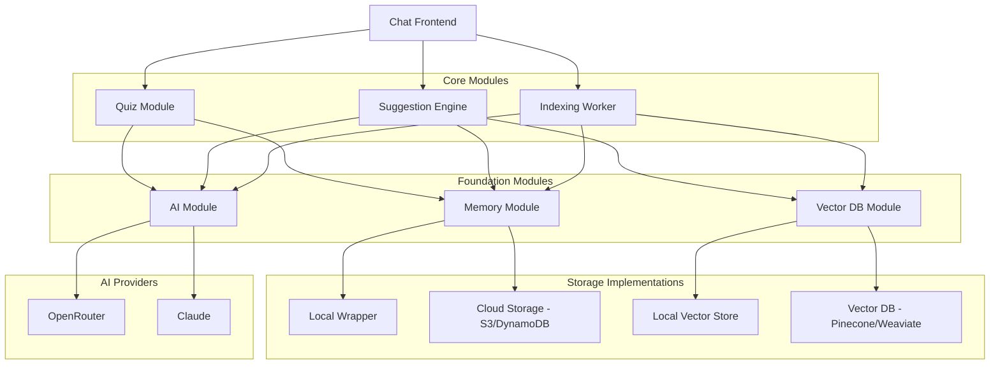
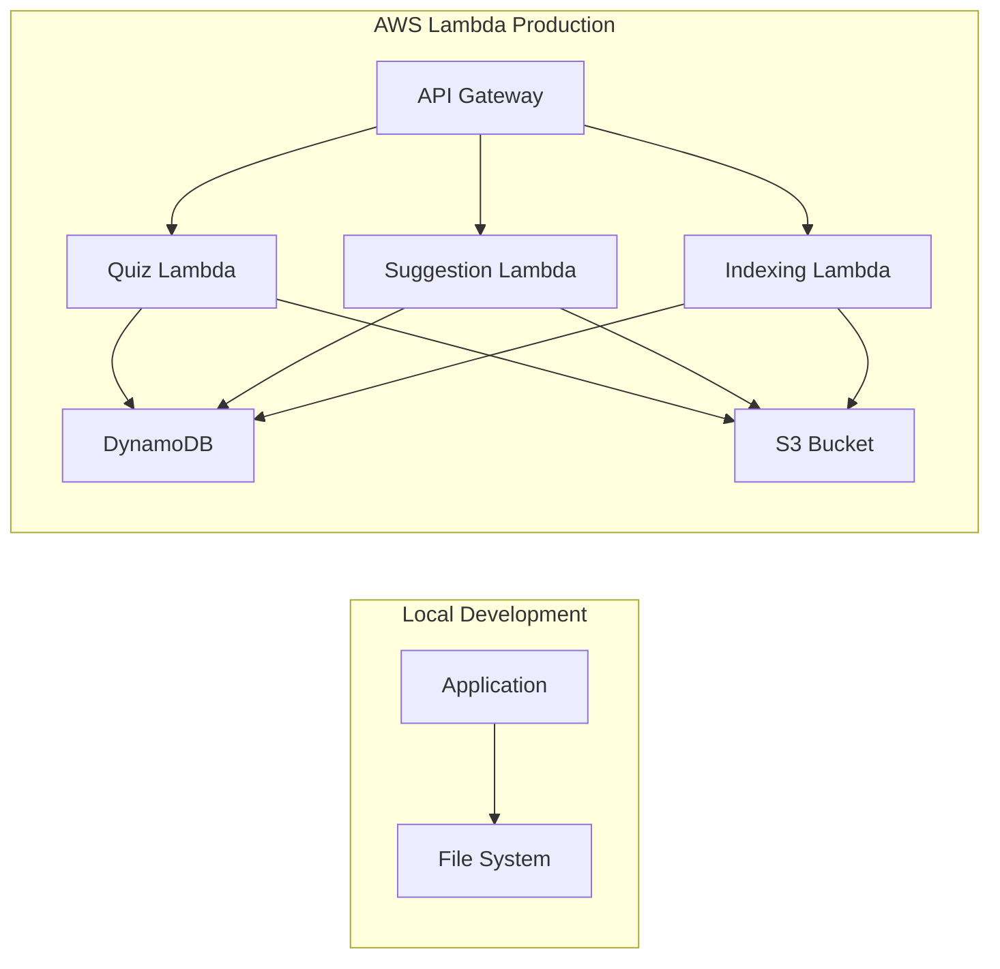

# Design Document: AI Tutor System

## Overview

The AI Tutor System is a modular, serverless C# application that provides structured learning through predefined curricula. The architecture follows SOLID principles with clear separation between storage, AI operations, and business logic. The system supports both local development and AWS Lambda deployment through abstraction layers.

The learning flow follows this cycle:
1. Student selects a learning path (e.g., Python)
2. Baseline assessment establishes current knowledge level
3. Personalized learning plan is created
4. Student receives content recommendations for current task
5. Progress quiz verifies skill acquisition
6. Profile updates and cycle continues, or alternative materials are suggested if quiz fails

## Architecture

### High-Level Architecture



### Project Structure

```
AITutorSystem/
├── src/
│   ├── AITutorSystem.Memory/          # Storage abstraction layer
│   │   ├── Interfaces/
│   │   │   └── IStorageProvider.cs
│   │   ├── Models/
│   │   │   ├── StudentProfile.cs
│   │   │   ├── LearningPath.cs
│   │   │   ├── IndexedMaterial.cs
│   │   │   └── QuizResult.cs
│   │   ├── Providers/
│   │   │   ├── LocalStorageProvider.cs
│   │   │   └── CloudStorageProvider.cs
│   │   └── StorageFactory.cs
│   │
│   ├── AITutorSystem.VectorDB/         # Vector database abstraction
│   │   ├── Interfaces/
│   │   │   └── IVectorStore.cs
│   │   ├── Models/
│   │   │   ├── VectorDocument.cs
│   │   │   └── SearchResult.cs
│   │   ├── Providers/
│   │   │   ├── LocalVectorStore.cs
│   │   │   ├── PineconeProvider.cs
│   │   │   └── WeaviateProvider.cs
│   │   └── VectorStoreFactory.cs
│   │
│   ├── AITutorSystem.AI/               # AI provider abstraction
│   │   ├── Interfaces/
│   │   │   └── IAIProvider.cs
│   │   ├── Models/
│   │   │   ├── AIRequest.cs
│   │   │   ├── AIResponse.cs
│   │   │   └── EmbeddingRequest.cs
│   │   ├── Providers/
│   │   │   ├── OpenRouterProvider.cs
│   │   │   └── ClaudeProvider.cs
│   │   └── AIFactory.cs
│   │
│   ├── AITutorSystem.Core/             # Business logic
│   │   ├── Quiz/
│   │   │   ├── IQuizService.cs
│   │   │   ├── QuizService.cs
│   │   │   └── QuizAnalyzer.cs
│   │   ├── Suggestion/
│   │   │   ├── ISuggestionService.cs
│   │   │   ├── SuggestionService.cs
│   │   │   └── RAGService.cs
│   │   ├── Indexing/
│   │   │   ├── IIndexingService.cs
│   │   │   └── IndexingService.cs
│   │   └── LearningPath/
│   │       ├── ILearningPathService.cs
│   │       └── LearningPathService.cs
│   │
│   ├── AITutorSystem.Lambda/           # AWS Lambda handlers
│   │   ├── QuizHandler.cs
│   │   ├── SuggestionHandler.cs
│   │   └── IndexingHandler.cs
│   │
│   └── AITutorSystem.Frontend/         # Chat interface
│       ├── ChatController.cs
│       └── wwwroot/
│
└── tests/
    ├── AITutorSystem.Memory.Tests/
    ├── AITutorSystem.VectorDB.Tests/
    ├── AITutorSystem.AI.Tests/
    └── AITutorSystem.Core.Tests/
```

### Deployment Architecture



## Components and Interfaces

### 1. Memory Module

The Memory Module provides storage abstraction supporting both local and cloud storage.

#### IStorageProvider Interface

```csharp
public interface IStorageProvider
{
    Task<T> GetAsync<T>(string key) where T : class;
    Task<bool> SaveAsync<T>(string key, T data) where T : class;
    Task<bool> UpdateAsync<T>(string key, T data) where T : class;
    Task<bool> DeleteAsync(string key);
    Task<IEnumerable<T>> QueryAsync<T>(Expression<Func<T, bool>> predicate) where T : class;
}
```

#### LocalStorageProvider

Uses JSON files on the local file system for development.

```csharp
public class LocalStorageProvider : IStorageProvider
{
    private readonly string _basePath;
    
    public LocalStorageProvider(string basePath)
    {
        _basePath = basePath;
    }
    
    public async Task<T> GetAsync<T>(string key) where T : class
    {
        // Read from {_basePath}/{typeof(T).Name}/{key}.json
        // Deserialize and return
    }
    
    // Additional methods...
}
```

#### CloudStorageProvider

Uses AWS S3 for large objects and DynamoDB for structured data.

```csharp
public class CloudStorageProvider : IStorageProvider
{
    private readonly IAmazonS3 _s3Client;
    private readonly IAmazonDynamoDB _dynamoClient;
    private readonly string _bucketName;
    private readonly string _tableName;
    
    public CloudStorageProvider(IAmazonS3 s3Client, IAmazonDynamoDB dynamoClient, 
                                string bucketName, string tableName)
    {
        _s3Client = s3Client;
        _dynamoClient = dynamoClient;
        _bucketName = bucketName;
        _tableName = tableName;
    }
    
    public async Task<T> GetAsync<T>(string key) where T : class
    {
        // Small objects: DynamoDB
        // Large objects (videos, materials): S3
    }
    
    // Additional methods...
}
```

#### StorageFactory

```csharp
public static class StorageFactory
{
    public static IStorageProvider Create(IConfiguration configuration)
    {
        var environment = configuration["Environment"];
        
        return environment switch
        {
            "Local" => new LocalStorageProvider(configuration["LocalStoragePath"]),
            "Lambda" => new CloudStorageProvider(
                new AmazonS3Client(),
                new AmazonDynamoDBClient(),
                configuration["S3Bucket"],
                configuration["DynamoTable"]
            ),
            _ => throw new InvalidOperationException($"Unknown environment: {environment}")
        };
    }
}
```

### 2. AI Module

The AI Module provides abstraction for multiple AI providers.

#### IAIProvider Interface

```csharp
public interface IAIProvider
{
    Task<AIResponse> GenerateAsync(AIRequest request);
    IAsyncEnumerable<string> StreamAsync(AIRequest request);
}
```

#### AIRequest Model

```csharp
public class AIRequest
{
    public string SystemPrompt { get; set; }
    public string UserPrompt { get; set; }
    public double Temperature { get; set; } = 0.7;
    public int MaxTokens { get; set; } = 1000;
    public Dictionary<string, object> AdditionalParameters { get; set; }
}
```

#### AIResponse Model

```csharp
public class AIResponse
{
    public string Content { get; set; }
    public int TokensUsed { get; set; }
    public string Model { get; set; }
    public bool Success { get; set; }
    public string ErrorMessage { get; set; }
}
```

#### OpenRouterProvider

```csharp
public class OpenRouterProvider : IAIProvider
{
    private readonly HttpClient _httpClient;
    private readonly string _apiKey;
    private readonly string _model;
    
    public OpenRouterProvider(HttpClient httpClient, string apiKey, string model)
    {
        _httpClient = httpClient;
        _apiKey = apiKey;
        _model = model;
    }
    
    public async Task<AIResponse> GenerateAsync(AIRequest request)
    {
        // Call OpenRouter API
        // Parse response
        // Return AIResponse
    }
    
    public async IAsyncEnumerable<string> StreamAsync(AIRequest request)
    {
        // Stream from OpenRouter API
        // Yield chunks as they arrive
    }
}
```

#### ClaudeProvider

```csharp
public class ClaudeProvider : IAIProvider
{
    private readonly HttpClient _httpClient;
    private readonly string _apiKey;
    private readonly string _model;
    
    public ClaudeProvider(HttpClient httpClient, string apiKey, string model)
    {
        _httpClient = httpClient;
        _apiKey = apiKey;
        _model = model;
    }
    
    public async Task<AIResponse> GenerateAsync(AIRequest request)
    {
        // Call Claude API
        // Parse response
        // Return AIResponse
    }
    
    public async IAsyncEnumerable<string> StreamAsync(AIRequest request)
    {
        // Stream from Claude API
        // Yield chunks as they arrive
    }
}
```

#### AIFactory

```csharp
public static class AIFactory
{
    public static IAIProvider Create(IConfiguration configuration, HttpClient httpClient)
    {
        var provider = configuration["AIProvider"];
        var apiKey = configuration[$"{provider}:ApiKey"];
        var model = configuration[$"{provider}:Model"];
        
        return provider switch
        {
            "OpenRouter" => new OpenRouterProvider(httpClient, apiKey, model),
            "Claude" => new ClaudeProvider(httpClient, apiKey, model),
            _ => throw new InvalidOperationException($"Unknown AI provider: {provider}")
        };
    }
}
```

### 3. Quiz Module

Handles baseline assessments, progress quizzes, and result analysis.

#### IQuizService Interface

```csharp
public interface IQuizService
{
    Task<Quiz> GenerateBaselineAssessmentAsync(string learningPathId);
    Task<Quiz> GenerateProgressQuizAsync(string studentId, string taskId);
    Task<QuizResult> EvaluateQuizAsync(string quizId, Dictionary<string, string> answers);
    Task<LearningPlan> CreateLearningPlanAsync(string studentId, QuizResult baselineResult);
}
```

#### QuizService Implementation

```csharp
public class QuizService : IQuizService
{
    private readonly IAIProvider _aiProvider;
    private readonly IStorageProvider _storage;
    private readonly IQuizAnalyzer _analyzer;
    
    public QuizService(IAIProvider aiProvider, IStorageProvider storage, IQuizAnalyzer analyzer)
    {
        _aiProvider = aiProvider;
        _storage = storage;
        _analyzer = analyzer;
    }
    
    public async Task<Quiz> GenerateBaselineAssessmentAsync(string learningPathId)
    {
        // Load learning path
        var learningPath = await _storage.GetAsync<LearningPath>(learningPathId);
        
        // Create AI prompt for baseline assessment
        var prompt = BuildBaselinePrompt(learningPath);
        
        // Generate quiz using AI
        var response = await _aiProvider.GenerateAsync(new AIRequest
        {
            SystemPrompt = "You are an expert educator creating diagnostic assessments.",
            UserPrompt = prompt
        });
        
        // Parse quiz from response
        var quiz = ParseQuizFromResponse(response.Content);
        
        // Save quiz
        await _storage.SaveAsync($"quiz_{quiz.Id}", quiz);
        
        return quiz;
    }
    
    public async Task<QuizResult> EvaluateQuizAsync(string quizId, Dictionary<string, string> answers)
    {
        // Load quiz
        var quiz = await _storage.GetAsync<Quiz>(quizId);
        
        // Analyze answers
        var result = _analyzer.Analyze(quiz, answers);
        
        // Save result
        await _storage.SaveAsync($"result_{result.Id}", result);
        
        return result;
    }
    
    public async Task<LearningPlan> CreateLearningPlanAsync(string studentId, QuizResult baselineResult)
    {
        // Load student profile
        var profile = await _storage.GetAsync<StudentProfile>(studentId);
        
        // Analyze baseline to identify gaps
        var gaps = _analyzer.IdentifyKnowledgeGaps(baselineResult);
        
        // Create prioritized task list
        var plan = new LearningPlan
        {
            StudentId = studentId,
            Tasks = PrioritizeTasks(profile.LearningPath.Tasks, gaps),
            CreatedAt = DateTime.UtcNow
        };
        
        // Update profile
        profile.CurrentPlan = plan;
        await _storage.UpdateAsync(studentId, profile);
        
        return plan;
    }
    
    private string BuildBaselinePrompt(LearningPath path)
    {
        // Build prompt describing learning path goals and requesting diagnostic questions
    }
    
    private Quiz ParseQuizFromResponse(string content)
    {
        // Parse structured quiz from AI response
    }
    
    private List<LearningTask> PrioritizeTasks(List<LearningTask> tasks, List<KnowledgeGap> gaps)
    {
        // Reorder tasks based on identified gaps
    }
}
```

### 4. Suggestion Engine

Recommends learning materials based on student profile and current task.

#### ISuggestionService Interface

```csharp
public interface ISuggestionService
{
    Task<List<MaterialSuggestion>> GetSuggestionsAsync(string studentId, string taskId);
    Task<List<MaterialSuggestion>> GetRetrySuggestionsAsync(string studentId, string taskId, 
                                                             List<string> excludeIds);
}
```

#### SuggestionService Implementation

```csharp
public class SuggestionService : ISuggestionService
{
    private readonly IStorageProvider _storage;
    private readonly IAIProvider _aiProvider;
    
    public SuggestionService(IStorageProvider storage, IAIProvider aiProvider)
    {
        _storage = storage;
        _aiProvider = aiProvider;
    }
    
    public async Task<List<MaterialSuggestion>> GetSuggestionsAsync(string studentId, string taskId)
    {
        // Load student profile
        var profile = await _storage.GetAsync<StudentProfile>(studentId);
        
        // Get current task
        var task = profile.CurrentPlan.Tasks.First(t => t.Id == taskId);
        
        // Query indexed materials matching task topic
        var materials = await _storage.QueryAsync<IndexedMaterial>(
            m => m.Topics.Any(t => task.Topics.Contains(t))
        );
        
        // Rank materials using AI
        var rankedMaterials = await RankMaterialsAsync(materials, profile, task);
        
        return rankedMaterials.Take(5).ToList();
    }
    
    public async Task<List<MaterialSuggestion>> GetRetrySuggestionsAsync(
        string studentId, string taskId, List<string> excludeIds)
    {
        // Load student profile
        var profile = await _storage.GetAsync<StudentProfile>(studentId);
        
        // Get current task and failed quiz result
        var task = profile.CurrentPlan.Tasks.First(t => t.Id == taskId);
        var lastQuizResult = await GetLastQuizResultAsync(studentId, taskId);
        
        // Identify specific sub-topics from failed quiz
        var weakTopics = IdentifyWeakTopics(lastQuizResult);
        
        // Query materials excluding previous suggestions
        var materials = await _storage.QueryAsync<IndexedMaterial>(
            m => m.Topics.Any(t => weakTopics.Contains(t)) && !excludeIds.Contains(m.Id)
        );
        
        // Prioritize different teaching styles
        var previousStyles = await GetPreviousTeachingStylesAsync(studentId, taskId);
        var alternativeMaterials = materials
            .Where(m => !previousStyles.Contains(m.TeachingStyle))
            .ToList();
        
        // Rank and return
        var rankedMaterials = await RankMaterialsAsync(alternativeMaterials, profile, task);
        
        return rankedMaterials.Take(5).ToList();
    }
    
    private async Task<List<MaterialSuggestion>> RankMaterialsAsync(
        IEnumerable<IndexedMaterial> materials, StudentProfile profile, LearningTask task)
    {
        // Use AI to rank materials based on relevance
        var prompt = BuildRankingPrompt(materials, profile, task);
        var response = await _aiProvider.GenerateAsync(new AIRequest
        {
            SystemPrompt = "You are an expert at matching learning materials to student needs.",
            UserPrompt = prompt
        });
        
        // Parse ranking from response
        return ParseRankedMaterials(response.Content, materials);
    }
}
```

### 5. Indexing Worker

Processes YouTube videos to extract educational metadata.

#### IIndexingService Interface

```csharp
public interface IIndexingService
{
    Task IndexChannelAsync(string channelUrl);
    Task IndexVideoAsync(string videoUrl);
}
```

#### IndexingService Implementation

```csharp
public class IndexingService : IIndexingService
{
    private readonly IAIProvider _aiProvider;
    private readonly IStorageProvider _storage;
    private readonly HttpClient _httpClient;
    
    public IndexingService(IAIProvider aiProvider, IStorageProvider storage, HttpClient httpClient)
    {
        _aiProvider = aiProvider;
        _storage = storage;
        _httpClient = httpClient;
    }
    
    public async Task IndexChannelAsync(string channelUrl)
    {
        // Extract channel ID from URL
        var channelId = ExtractChannelId(channelUrl);
        
        // Fetch video list from YouTube API
        var videoIds = await FetchChannelVideosAsync(channelId);
        
        // Index each video
        foreach (var videoId in videoIds)
        {
            try
            {
                await IndexVideoAsync($"https://youtube.com/watch?v={videoId}");
            }
            catch (Exception ex)
            {
                // Log error and continue
                Console.WriteLine($"Failed to index video {videoId}: {ex.Message}");
            }
        }
    }
    
    public async Task IndexVideoAsync(string videoUrl)
    {
        // Extract video ID
        var videoId = ExtractVideoId(videoUrl);
        
        // Fetch video metadata and transcript
        var metadata = await FetchVideoMetadataAsync(videoId);
        var transcript = await FetchTranscriptAsync(videoId);
        
        // Use AI to analyze content
        var analysis = await AnalyzeVideoContentAsync(metadata, transcript);
        
        // Create indexed material
        var indexedMaterial = new IndexedMaterial
        {
            Id = videoId,
            Title = metadata.Title,
            Url = videoUrl,
            Channel = metadata.Channel,
            Topics = analysis.Topics,
            TeachingStyle = analysis.TeachingStyle,
            DifficultyLevel = analysis.DifficultyLevel,
            Duration = metadata.Duration,
            IndexedAt = DateTime.UtcNow
        };
        
        // Save to storage
        await _storage.SaveAsync($"material_{videoId}", indexedMaterial);
    }
    
    private async Task<VideoAnalysis> AnalyzeVideoContentAsync(VideoMetadata metadata, string transcript)
    {
        var prompt = $@"Analyze this educational video:
Title: {metadata.Title}
Description: {metadata.Description}
Transcript: {transcript}

Extract:
1. Main topics covered (list)
2. Teaching style (visual, theoretical, hands-on, etc.)
3. Difficulty level (beginner, intermediate, advanced)";
        
        var response = await _aiProvider.GenerateAsync(new AIRequest
        {
            SystemPrompt = "You are an expert at analyzing educational content.",
            UserPrompt = prompt
        });
        
        return ParseVideoAnalysis(response.Content);
    }
}
```

### 6. Learning Path Service

Manages predefined learning paths and their goals.

#### ILearningPathService Interface

```csharp
public interface ILearningPathService
{
    Task<List<LearningPath>> GetAvailablePathsAsync();
    Task<LearningPath> GetPathAsync(string pathId);
    Task<LearningPath> CreatePathAsync(LearningPath path);
}
```

## Data Models

### StudentProfile

```csharp
public class StudentProfile
{
    public string Id { get; set; }
    public string Name { get; set; }
    public string CurrentLearningPathId { get; set; }
    public LearningPath LearningPath { get; set; }
    public LearningPlan CurrentPlan { get; set; }
    public List<CompletedTask> CompletedTasks { get; set; }
    public List<QuizResult> QuizHistory { get; set; }
    public Dictionary<string, int> KnowledgeLevel { get; set; } // Topic -> Level
    public DateTime CreatedAt { get; set; }
    public DateTime UpdatedAt { get; set; }
}
```

### LearningPath

```csharp
public class LearningPath
{
    public string Id { get; set; }
    public string Name { get; set; } // e.g., "Python Programming"
    public string Description { get; set; }
    public List<string> Goals { get; set; }
    public List<LearningTask> Tasks { get; set; }
    public string DifficultyLevel { get; set; }
}
```

### LearningTask

```csharp
public class LearningTask
{
    public string Id { get; set; }
    public string Title { get; set; }
    public string Description { get; set; }
    public List<string> Topics { get; set; }
    public List<string> Prerequisites { get; set; }
    public int Order { get; set; }
}
```

### LearningPlan

```csharp
public class LearningPlan
{
    public string Id { get; set; }
    public string StudentId { get; set; }
    public List<LearningTask> Tasks { get; set; } // Prioritized based on baseline
    public string CurrentTaskId { get; set; }
    public DateTime CreatedAt { get; set; }
}
```

### Quiz

```csharp
public class Quiz
{
    public string Id { get; set; }
    public string Type { get; set; } // "Baseline" or "Progress"
    public string StudentId { get; set; }
    public string TaskId { get; set; } // Null for baseline
    public List<QuizQuestion> Questions { get; set; }
    public DateTime CreatedAt { get; set; }
}
```

### QuizQuestion

```csharp
public class QuizQuestion
{
    public string Id { get; set; }
    public string Text { get; set; }
    public List<string> Options { get; set; }
    public string CorrectAnswer { get; set; }
    public string Topic { get; set; }
    public string DifficultyLevel { get; set; }
}
```

### QuizResult

```csharp
public class QuizResult
{
    public string Id { get; set; }
    public string QuizId { get; set; }
    public string StudentId { get; set; }
    public Dictionary<string, string> Answers { get; set; } // QuestionId -> Answer
    public int Score { get; set; }
    public int TotalQuestions { get; set; }
    public bool Passed { get; set; }
    public List<KnowledgeGap> IdentifiedGaps { get; set; }
    public DateTime CompletedAt { get; set; }
}
```

### KnowledgeGap

```csharp
public class KnowledgeGap
{
    public string Topic { get; set; }
    public string SubTopic { get; set; }
    public string Severity { get; set; } // "Critical", "Moderate", "Minor"
    public string Description { get; set; }
}
```

### IndexedMaterial

```csharp
public class IndexedMaterial
{
    public string Id { get; set; }
    public string Title { get; set; }
    public string Url { get; set; }
    public string Channel { get; set; }
    public List<string> Topics { get; set; }
    public string TeachingStyle { get; set; }
    public string DifficultyLevel { get; set; }
    public TimeSpan Duration { get; set; }
    public DateTime IndexedAt { get; set; }
}
```

### MaterialSuggestion

```csharp
public class MaterialSuggestion
{
    public IndexedMaterial Material { get; set; }
    public double RelevanceScore { get; set; }
    public string ReasonForSuggestion { get; set; }
}
```


## Correctness Properties

A property is a characteristic or behavior that should hold true across all valid executions of a system—essentially, a formal statement about what the system should do. Properties serve as the bridge between human-readable specifications and machine-verifiable correctness guarantees.

### Property 1: Learning Path Availability

*For any* set of predefined learning paths stored in the system, querying for available paths should return all stored paths without omission.

**Validates: Requirements 1.1**

### Property 2: Session Initialization Completeness

*For any* learning path selection, initializing a session should create both a student profile and load the complete path definition including goals and tasks.

**Validates: Requirements 1.2, 1.3, 1.5**

### Property 3: Storage Round-Trip Consistency

*For any* data object (StudentProfile, LearningPath, IndexedMaterial, QuizResult, LearningPlan), saving it to storage and then retrieving it should produce an equivalent object.

**Validates: Requirements 1.4, 2.5, 6.4, 8.4**

### Property 4: Quiz Generation Coverage

*For any* learning path or task, generating a quiz (baseline or progress) should produce questions that cover the key topics defined in that path or task.

**Validates: Requirements 2.1, 4.1**

### Property 5: Knowledge Gap Identification

*For any* completed quiz with incorrect answers, analyzing the results should identify knowledge gaps corresponding to the topics of the missed questions.

**Validates: Requirements 2.2, 5.4**

### Property 6: Learning Plan Task Prioritization

*For any* baseline assessment result with identified gaps, the created learning plan should prioritize tasks addressing those gaps earlier in the sequence.

**Validates: Requirements 2.4**

### Property 7: Suggestion Topic Matching

*For any* task and set of indexed materials, generated suggestions should only include materials whose topics overlap with the task's topics.

**Validates: Requirements 3.1, 3.2**

### Property 8: Suggestion Ranking by Relevance

*For any* set of suggestions for a student with identified knowledge gaps, materials addressing those gaps should be ranked higher than materials that don't.

**Validates: Requirements 3.3**

### Property 9: Suggestion Metadata Completeness

*For any* material suggestion returned by the suggestion engine, it should include all required metadata fields: topic coverage, teaching style, title, URL, and channel.

**Validates: Requirements 3.5**

### Property 10: Quiz Evaluation Correctness

*For any* quiz and set of answers, evaluating the quiz should correctly count the number of correct answers and determine pass/fail based on a consistent threshold.

**Validates: Requirements 4.2**

### Property 11: Profile Update Consistency

*For any* student profile, after any operation (quiz completion, task progression, gap identification), the profile should maintain internal consistency with no contradictory state.

**Validates: Requirements 2.3, 4.3, 4.5**

### Property 12: Task Progression Sequence

*For any* student who passes a progress quiz, the system should advance to the next task in the learning plan's ordered sequence.

**Validates: Requirements 4.4**

### Property 13: Retry Suggestion Exclusion

*For any* retry suggestion request with a list of excluded material IDs, the returned suggestions should not include any materials from the exclusion list and should prioritize different teaching styles from previous attempts.

**Validates: Requirements 5.2, 5.3**

### Property 14: Prerequisite Suggestion After Multiple Failures

*For any* student who fails the same task multiple times (3+ attempts), the suggestion engine should include prerequisite materials in the recommendations.

**Validates: Requirements 5.5**

### Property 15: Channel Video Extraction Completeness

*For any* YouTube channel, indexing the channel should extract and process all publicly available videos in that channel.

**Validates: Requirements 6.1**

### Property 16: Video Indexing Metadata Extraction

*For any* processed video, the indexed material should contain extracted topics, teaching style classification, and difficulty level.

**Validates: Requirements 6.2, 6.3**

### Property 17: Indexing Error Recovery

*For any* batch of videos being indexed, if one video fails to process, the indexing worker should continue processing the remaining videos without stopping.

**Validates: Requirements 6.5, 13.5**

### Property 18: Frontend Message Routing

*For any* student message sent through the frontend, the message should be routed to the correct component based on message type (quiz request → Quiz Module, suggestion request → Suggestion Engine, etc.).

**Validates: Requirements 7.1**

### Property 19: Frontend Rendering Completeness

*For any* data displayed in the frontend (quiz, suggestions, progress), the rendered output should include all required elements for that data type.

**Validates: Requirements 7.2, 7.3, 7.4**

### Property 20: Environment-Based Storage Provider Selection

*For any* execution environment configuration (local or Lambda), the memory module should instantiate the correct storage provider matching that environment.

**Validates: Requirements 8.2, 8.3, 11.3**

### Property 21: Error Message Abstraction

*For any* error occurring in the Memory Module or AI Module, the returned error message should be descriptive but should not expose implementation-specific details (connection strings, provider internals, etc.).

**Validates: Requirements 8.5, 9.5, 13.2**

### Property 22: AI Provider Configuration Selection

*For any* AI provider configuration setting, the AI module should instantiate and use the provider specified in the configuration.

**Validates: Requirements 9.4**

### Property 23: AI Streaming Response Delivery

*For any* AI request configured for streaming, the response should be delivered as an async enumerable of chunks rather than a single complete response.

**Validates: Requirements 9.6**

### Property 24: Error Logging Context Completeness

*For any* error encountered in the system, the logged error should include sufficient context (component name, operation, input parameters) for debugging.

**Validates: Requirements 13.1**

### Property 25: Transient Failure Retry Count

*For any* storage operation that fails with a transient error, the system should retry exactly 3 times before returning a failure.

**Validates: Requirements 13.3**

### Property 26: Data Integrity on Failure

*For any* operation that fails after all retries, the student profile data in storage should remain unchanged from its state before the operation began.

**Validates: Requirements 13.4**

## Error Handling

### Error Categories

1. **Transient Errors**: Network timeouts, temporary service unavailability
   - Strategy: Retry up to 3 times with exponential backoff
   - Examples: S3 throttling, DynamoDB capacity exceeded

2. **Permanent Errors**: Invalid input, missing resources, authentication failures
   - Strategy: Fail immediately with descriptive error
   - Examples: Invalid video URL, missing learning path, expired API key

3. **Validation Errors**: Data that doesn't meet requirements
   - Strategy: Return validation error with specific field information
   - Examples: Empty quiz answers, invalid student ID format

### Error Response Format

```csharp
public class ErrorResponse
{
    public string ErrorCode { get; set; }
    public string Message { get; set; }
    public string UserFriendlyMessage { get; set; }
    public Dictionary<string, string> Details { get; set; }
    public DateTime Timestamp { get; set; }
}
```

### Retry Logic

```csharp
public async Task<T> ExecuteWithRetryAsync<T>(
    Func<Task<T>> operation, 
    int maxRetries = 3)
{
    var retryCount = 0;
    var delay = TimeSpan.FromMilliseconds(100);
    
    while (true)
    {
        try
        {
            return await operation();
        }
        catch (Exception ex) when (IsTransient(ex) && retryCount < maxRetries)
        {
            retryCount++;
            await Task.Delay(delay);
            delay = TimeSpan.FromMilliseconds(delay.TotalMilliseconds * 2); // Exponential backoff
        }
    }
}
```

### Logging Strategy

- **Local Development**: Console logging with detailed stack traces
- **Lambda Production**: CloudWatch logs with structured JSON format
- **Log Levels**: ERROR (failures), WARN (retries), INFO (operations), DEBUG (detailed flow)

## Testing Strategy

### Dual Testing Approach

The system requires both unit testing and property-based testing for comprehensive coverage:

- **Unit tests**: Verify specific examples, edge cases, and error conditions
- **Property tests**: Verify universal properties across all inputs

Both approaches are complementary and necessary. Unit tests catch concrete bugs in specific scenarios, while property tests verify general correctness across a wide range of inputs.

### Unit Testing

Unit tests should focus on:
- Specific examples that demonstrate correct behavior
- Integration points between components
- Edge cases (empty inputs, null values, boundary conditions)
- Error conditions and exception handling

Avoid writing too many unit tests for scenarios that property-based tests can cover through randomization.

### Property-Based Testing

**Framework**: Use [FsCheck](https://fscheck.github.io/FsCheck/) for C# property-based testing.

**Configuration**:
- Minimum 100 iterations per property test (due to randomization)
- Each property test must reference its design document property
- Tag format: `[Property(Arbitrary = new[] { typeof(Generators) })]`
- Comment format: `// Feature: ai-tutor-system, Property {number}: {property_text}`

**Example Property Test**:

```csharp
[Property]
[Trait("Feature", "ai-tutor-system")]
public Property StorageRoundTripConsistency()
{
    // Feature: ai-tutor-system, Property 3: Storage Round-Trip Consistency
    
    return Prop.ForAll<StudentProfile>(profile =>
    {
        // Arrange
        var storage = new LocalStorageProvider("./test-data");
        var key = $"student_{profile.Id}";
        
        // Act
        storage.SaveAsync(key, profile).Wait();
        var retrieved = storage.GetAsync<StudentProfile>(key).Result;
        
        // Assert
        return profile.Equals(retrieved);
    });
}
```

**Custom Generators**:

Create custom generators for domain models to ensure valid test data:

```csharp
public static class Generators
{
    public static Arbitrary<StudentProfile> StudentProfiles()
    {
        return Arb.From(
            from id in Arb.Generate<Guid>()
            from name in Arb.Generate<NonEmptyString>()
            from pathId in Arb.Generate<Guid>()
            select new StudentProfile
            {
                Id = id.ToString(),
                Name = name.Get,
                CurrentLearningPathId = pathId.ToString(),
                CompletedTasks = new List<CompletedTask>(),
                QuizHistory = new List<QuizResult>(),
                KnowledgeLevel = new Dictionary<string, int>(),
                CreatedAt = DateTime.UtcNow,
                UpdatedAt = DateTime.UtcNow
            }
        );
    }
}
```

### Integration Testing

Integration tests should verify:
- End-to-end learning flow (path selection → baseline → suggestions → progress quiz)
- Storage provider switching between local and cloud
- AI provider switching between OpenRouter and Claude
- Lambda handler invocation and response formatting

### Test Organization

```
tests/
├── AITutorSystem.Memory.Tests/
│   ├── Unit/
│   │   ├── LocalStorageProviderTests.cs
│   │   └── CloudStorageProviderTests.cs
│   └── Properties/
│       ├── StorageRoundTripTests.cs
│       └── Generators.cs
│
├── AITutorSystem.AI.Tests/
│   ├── Unit/
│   │   ├── OpenRouterProviderTests.cs
│   │   └── ClaudeProviderTests.cs
│   └── Properties/
│       ├── AIProviderTests.cs
│       └── Generators.cs
│
└── AITutorSystem.Core.Tests/
    ├── Unit/
    │   ├── QuizServiceTests.cs
    │   ├── SuggestionServiceTests.cs
    │   └── IndexingServiceTests.cs
    ├── Properties/
    │   ├── QuizPropertiesTests.cs
    │   ├── SuggestionPropertiesTests.cs
    │   └── Generators.cs
    └── Integration/
        └── LearningFlowTests.cs
```

### Mocking Strategy

- Mock external dependencies (YouTube API, AI providers) in unit tests
- Use real implementations with test data in property tests
- Use in-memory storage for fast property test execution
- Use actual AWS services in integration tests (with test accounts)
